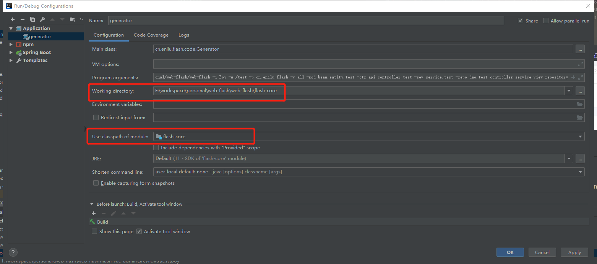
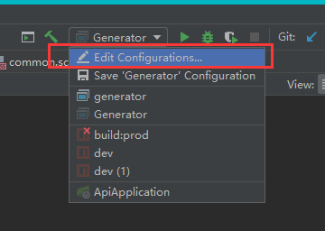
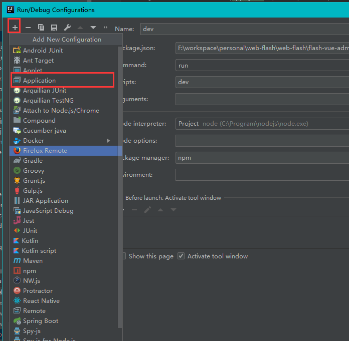
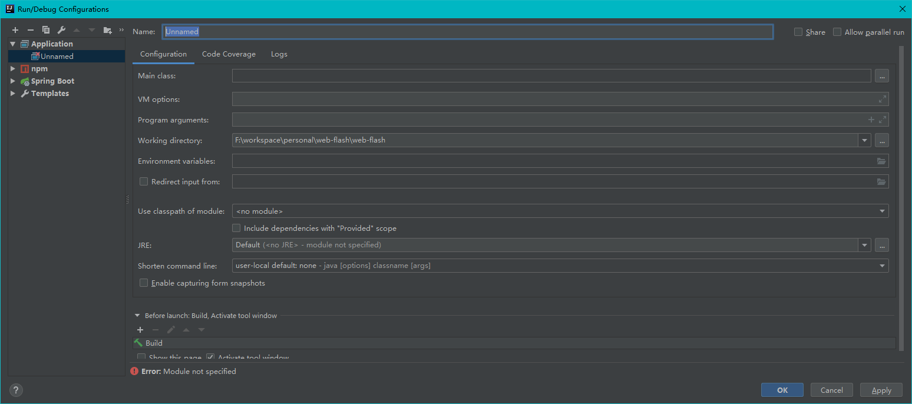
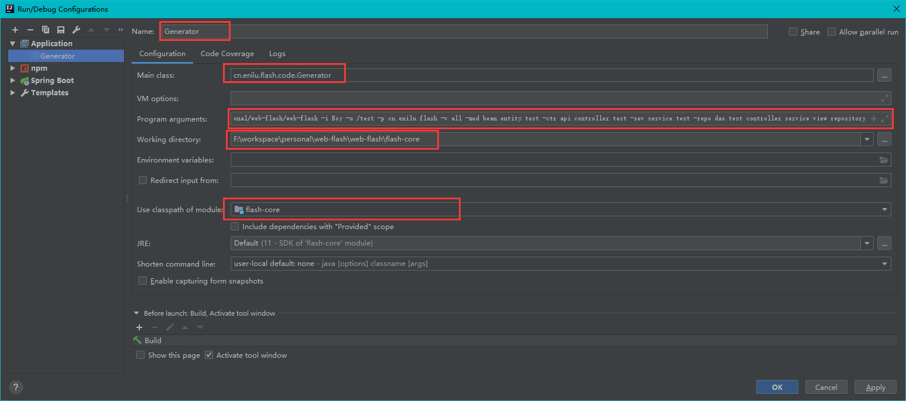

# web-flash代码生成工具
 
本项目提供了基于IDEA的插件来生成代码,你可以再idea插件仓库中搜索webflash-generator，或者直接从本地安装插件：flash-generator/idea-plugin.jar即可
用法如下：

- 写好实体类，例如：
```java
package com.xinshucredit.edu.bean.entity.test;
import com.xinshucredit.edu.bean.entity.BaseEntity;
import lombok.Data;
import org.hibernate.annotations.Table;
import javax.persistence.Column;
import javax.persistence.Entity;

@Data
@Entity(name="t_test_boy")
@Table(appliesTo = "t_test_boy",comment = "男孩")
public class Boy extends BaseEntity {
    @Column(columnDefinition = "INT COMMENT '年龄'")
    private Integer age;
    @Column(columnDefinition = "VARCHAR(32) COMMENT '名称'")
    private String name;

}
``` 
- 上面实体类注意事项
    - @Table注解要使用org.hibernate.annotations.Table 不要使用javax.persistence.Table
    - @Table注解 必须配置表名(applyiesTo)和注释(comment)
    - @Column注解必须配置columnDefinition来表述列信息(英文全部大写)：包括类型,注释COMMENT
    - 实体类必须继承BaseEntity
- 实体类准备好了后,打开实体类，右键选择Generator(或者Alt+Insert)-->web-flash-mvc，弹出如下图所示对话框  
 
 
 - 选择web-flash mvc，在弹框中勾选生成选项 
 
  
 - 点击生成即可，生成完毕后在vue的router/index.js添加路由，启动api和vue项目，配置上菜单和角色后即可使用
        


以Boy实体为例,执行代码生成后将会生成如下文件：

 

启动flash-api和flash-vue-admin,配置和菜单和角色权限后就可以访问刚刚生成的代码功能了


## 手动生成代码
- 部分版本idea的插件存在兼容性问题，无法使用代码生成插件生成代码，本系统提供了手动生成代码的方式，具体用法参考：[cn.enilu.flash.CodeGenerator](https://gitee.com/enilu/web-flash/blob/master/flash-core/src/main/java/cn/enilu/flash/CodeGenerator.java)

## FAQ

<br>

- Q:生成代码失败？
- A:没有生成代码的原因又很多：
    - 1.要生成的代码没有编译生成class文件，点击idea菜单rebuild或者通过mvn package 生成项目class文件
    - 2.检查插件运行过程生成的idea运行配置是否和如下一致,尤其是红框部分：
        
        

<br><br>
- Q:代码生成插件webflash-generator安装不上去
- A:代码生成插件并没有进行严格的版本兼容测试，对于新版本idea的兼容性并不好，建议有条件的使用老版本idea，比如作者使用的是2018.3版本的IDEA；另外代码生成插件只是提供一个生成代码的配置界面，本质上还是调用flash-generator里的代码生成逻辑。所以用户可以参考上面的运行配置，新建一个java运行配置来生成代码。具体生成代码步骤参考下面：
    - 1.在工具栏的运行配置菜单上点击EditConfigurations...：
    - 2.在配置窗口，点击“+”在下拉菜单中选择“Application"新建一个java运行配置：
    - 3.配置窗口如下：
    - 4.在配置窗口中输入配置名称：Generator，Main Class 输入cn.enilu.flash.code.Generator,参数配置输入生成代码的相关配置，下面专门介绍，Working directory为代码工作目录，选择flash-core所在目录，Use classpath of modules 选择flash-clore，如下图红框所示：
    - 5.点击ok
    - 6.在运行窗口选择Geneartor，点击后面运行箭头运行该配置，即可生成代码:
    - 7.这里介绍详细的Program arguements,也就程序的运行参数配置
        - 下面介绍具体配置参数，实际配置中参数不能换行，下面为了方便解释换行显示:
        ```
        -basePath F:/workspace/personal/web-flash/web-flash 表示代码要生成到的主项目目录
        -i Boy  表示要针对Boy这个java 类生成其相关代码
        -u /test /test 表示这个类所在的业务包名
        -p cn.enilu.flash 表示这个类所在的基础包名
        -f 表示强制覆盖之前已经生成好的代码，如果不强制覆盖，去掉该参数
        -v all 生成前端界面，如果不需要可以删除该配置
        -ctr api.controller.test  生成controller 如果不需要可以删除该配置
        -sev service.test  生成对应service 如果不需要可以删除该配置
        -repo dao.test 生成对应repository 如果不需要可以删除该配置
        ```  
        - 完整配置如下,具体使用中可以拷贝如下配置做适当调整即可使用：
        ```
        -basePath F:/workspace/personal/web-flash/web-flash -i Boy -u /test -p cn.enilu.flash -f -v all  -ctr api.controller.test -sev service.test -repo dao.test 
        ```

<br><br>
     
- Q:代码生成插件为什么不兼容新版本IDEA，不开心！！弃坑！！！
- A:个人精力有限，没空一个个版本测试；如果执意想用插件，自己拿源码调整去：[https://gitee.com/enilu/webflash-generator](https://gitee.com/enilu/webflash-generator)


        
        
